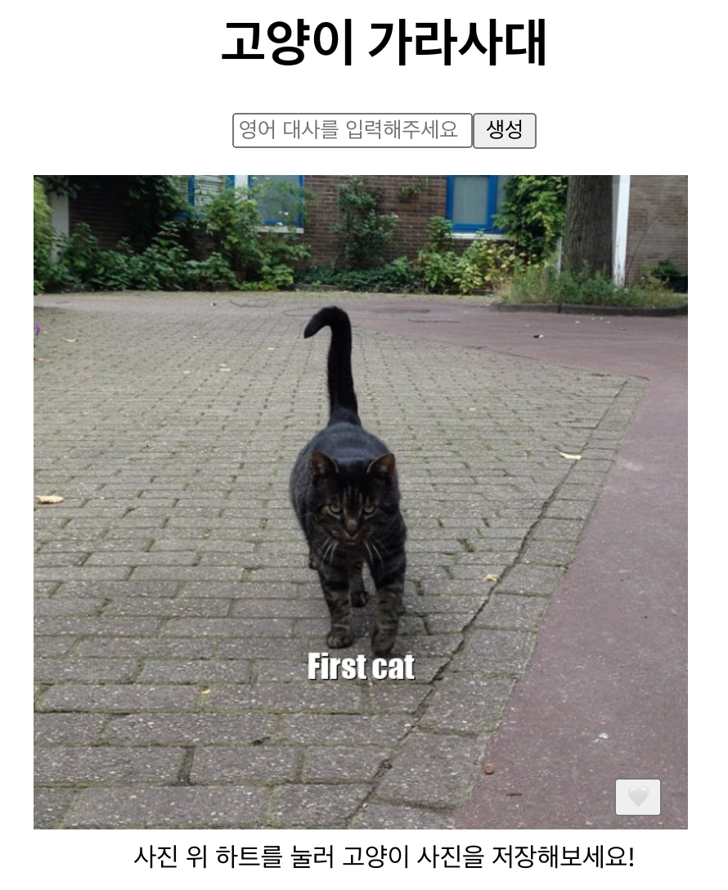
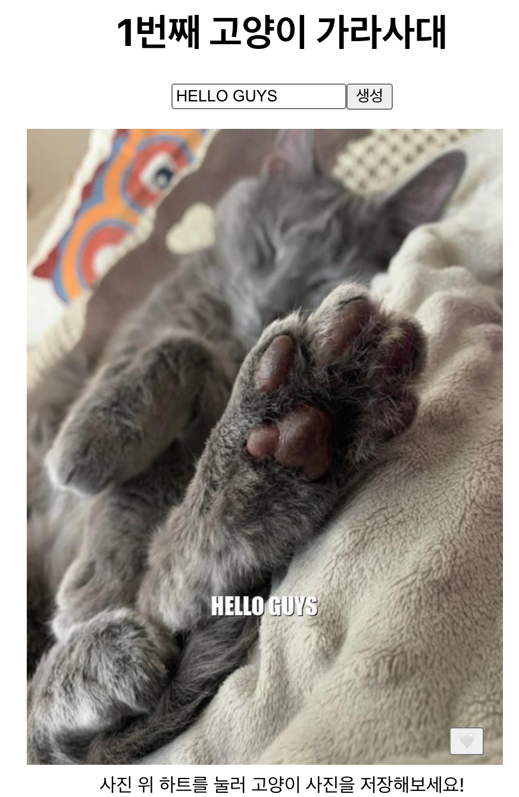
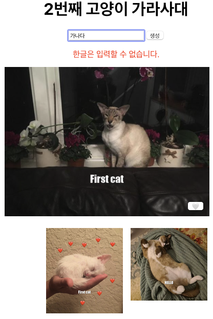
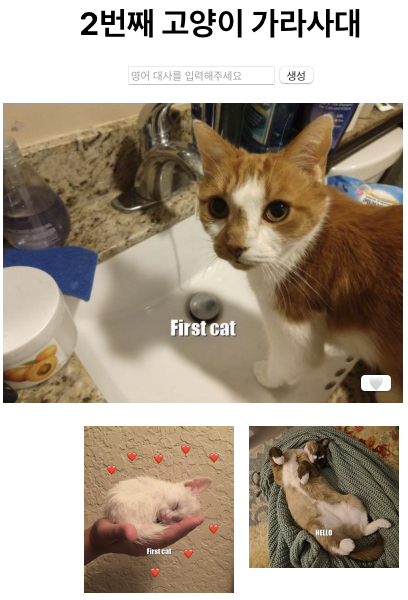
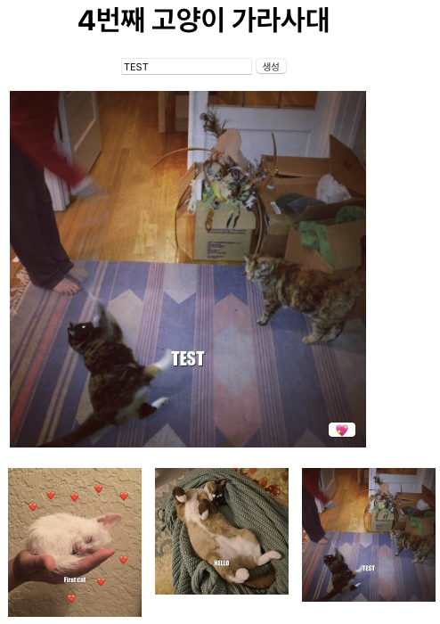

# Cat Meme Maker
## Description
프론트엔드 개발자로서 더 성장하고자 React를 공부하고 있습니다. 
Public api를 사용한 고양이 밈 메이커입니다. 
## Files
해당 저장소는 이러한 파일들을 포함합니다:  
 
- index.html : React-App 을 사용하지 않은 채 React를 이용해 구현하였습니다.
- [cat-meme-maker-cra]
  - src
    - App : 컴포넌트들을 랜더하여 출력합니다.
    - [components] : 각 기능별로 조각화 시킨 파일입니다.
 

## Environment
- OS
  - Mac
- IDE
  - VScode
- Language
  - React
 

## Feature
 

 
1. 메인화면입니다. 
기본 이미지에서 Open API를 이용했기에 고양이 이미지가 자동으로 불러와집니다.
 
 

 
2. 기능화면입니다.  
입력칸에 작성시 영어는 대문자로 변환되며 한글 작성시 오류 문구가 출력됩니다. 
한글 입력시 오류 문구가 출력됩니다. 
 
 

원하는 문구가 출력된 후 이미지 내에 있는 하트를 누를시 하단에 이미지가 저장됩니다.

